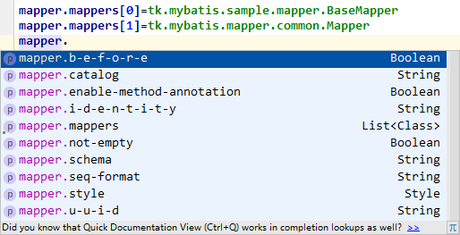

# MyBatis Mapper integration with Spring Boot

Mapper-Spring-Boot-Starter 帮助你集成通用 Mapper 到 Spring Boot。

Mapper-Spring-Boot-Starter will help you use Mapper with Spring Boot.

## How to use
在 pom.xml 中添加如下依赖：

Add the following dependency to your pom.xml: 
```xml
<dependency>
    <groupId>tk.mybatis</groupId>
    <artifactId>mapper-spring-boot-starter</artifactId>
    <version>1.1.4</version>
</dependency>
```
## 1.1.4 - 2017-08-18

- 通用 Mapper 3.4.3

## 1.1.3 - 2017-07-18

- 通用 Mapper 3.4.2

## 1.1.2 - 2017-07-17

- 通用 Mapper 3.4.1
- mybatis 3.4.4
- mybatis-spring-boot 1.3.0
- spring-boot 1.5.4.RELEASE

## 1.1.1 - 2017-03-28

- 解决 1.1.0 版本不一致的问题
- 增加对多数据源的支持，感谢 邱占波的 [PR #2](https://github.com/abel533/mapper-boot-starter/pull/2)

## 1.1.0 - 2017-02-19

- mybatis 升级到 3.4.2
- mapper 升级到 3.4.0
- mybatis-spring 升级到 1.3.1
- mybatis-spring-boot 升级到 1.2.0
- spring-boot 升级到 1.4.4.RELEASE

## Example
>https://github.com/abel533/MyBatis-Spring-Boot

## Special Configurations
一般情况下，你不需要做任何配置。

Normally, you don't need to do any configuration.

如果需要配置，可以使用如下方式进行配置：

You can config PageHelper as the following:

application.properties:
```properties
mapper.propertyName=propertyValue
```

示例:
```properties
mapper.mappers[0]=tk.mybatis.sample.mapper.BaseMapper
mapper.mappers[1]=tk.mybatis.mapper.common.Mapper
```
默认情况下，没有 mappers 配置时，会自动注册 `tk.mybatis.mapper.common.Mapper`

因为通用 Mapper 是固定的属性，所以接收参数使用的对象，按照 Spring Boot 配置规则，大写字母都变了带横线的小写字母。针对如 IDENTITY（对应i-d-e-n-t-i-t-y）提供了全小写的 identity 配置，如果 IDE 能自动提示，看自动提示即可。

IDE 应该可以自动提示：  



## MyBatis Mapper
>https://github.com/abel533/Mapper
